# Architecture Documentation

Comprehensive architecture documentation for the Opal Streaks Service implementation.

---

## System Overview

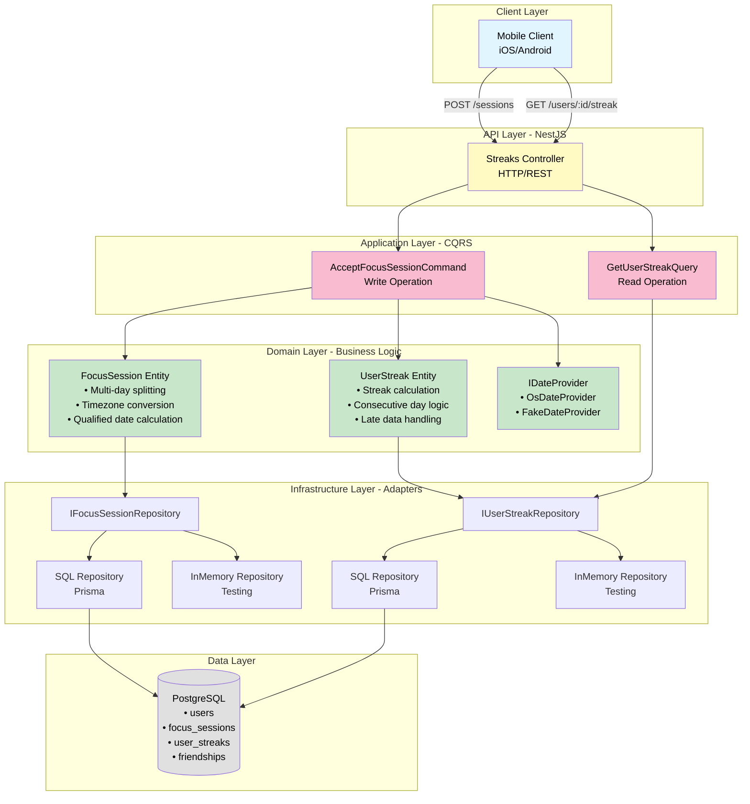

---

## Hexagonal Architecture Layers

### 1. **Domain Layer** (Core Business Logic)

Pure TypeScript with no framework dependencies.

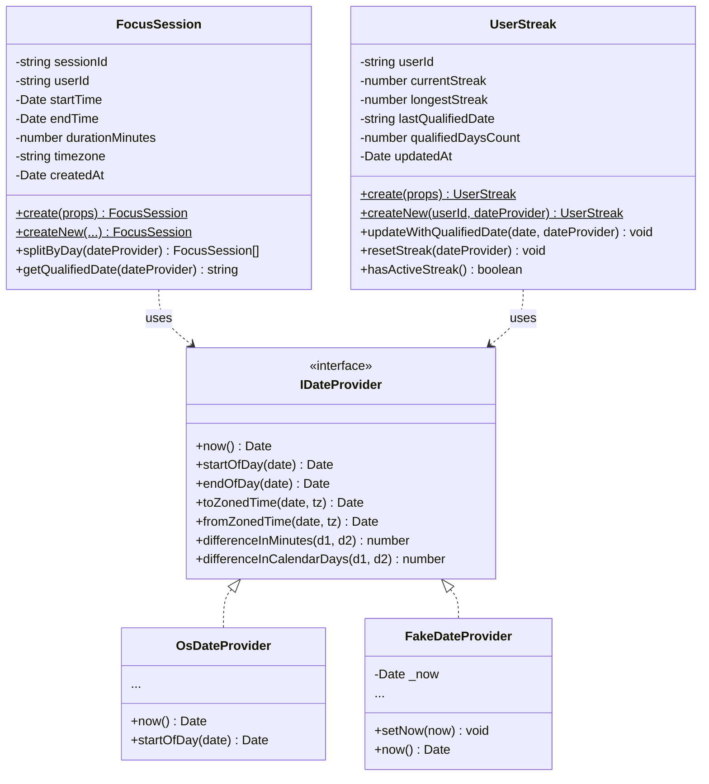

**Key Responsibilities**:

- **FocusSession**: Multi-day session splitting, timezone conversion, qualified date calculation
- **UserStreak**: Streak calculation logic, consecutive day tracking, late data handling
- **IDateProvider**: Timezone-aware date operations (abstracted for testing)

**Business Rules Enforced**:

- Session endTime must be after startTime
- Streak increments only for consecutive days
- Qualified day requires ≥30 minutes total focus time
- Multi-day sessions split at midnight in user's timezone

---

### 2. **Application Layer** (Use Cases - CQRS)

Orchestrates domain logic without containing business rules.

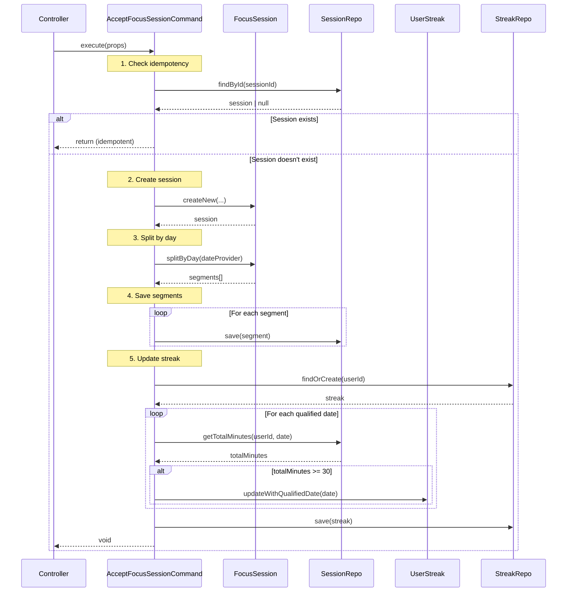

**Commands** (Write Operations):

- `AcceptFocusSessionCommand`: Accepts session, updates streaks, returns `void`

**Queries** (Read Operations):

- `GetUserStreakQuery`: Retrieves streak data, returns `UserStreakResult`

**CQRS Benefits**:

- Clear separation of reads and writes
- Optimized query paths (no business logic)
- Type-safe contracts (compile-time enforcement)

---

### 3. **Infrastructure Layer** (Adapters)

Implements repository interfaces using external technologies.

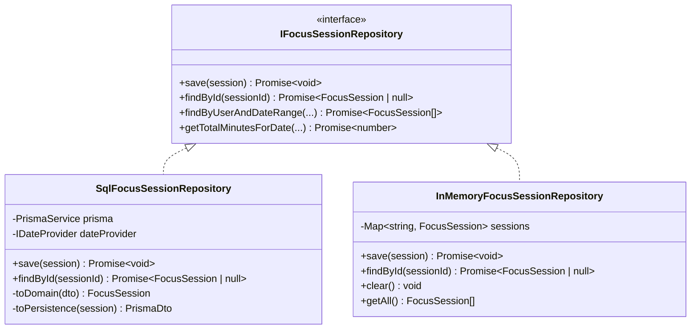

**Implementations**:

- **SQL Repositories**: Production adapters using Prisma ORM
- **InMemory Repositories**: Testing adapters (no database dependency)

**Mapping Strategy**:

- **Domain → Persistence**: `toPersistence(entity)` converts domain model to Prisma DTO
- **Persistence → Domain**: `toDomain(dto)` converts Prisma DTO to domain entity

---

### 4. **Presentation Layer** (Entry Points)

HTTP controllers with Swagger documentation.

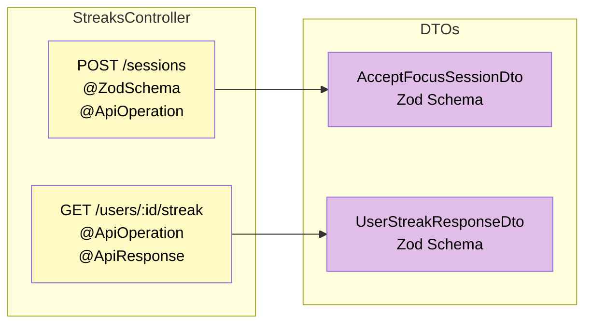

**Responsibilities**:

- HTTP routing and request handling
- DTO validation (Zod schemas)
- Swagger/OpenAPI documentation
- Correlation ID tracking

---

## Database Schema

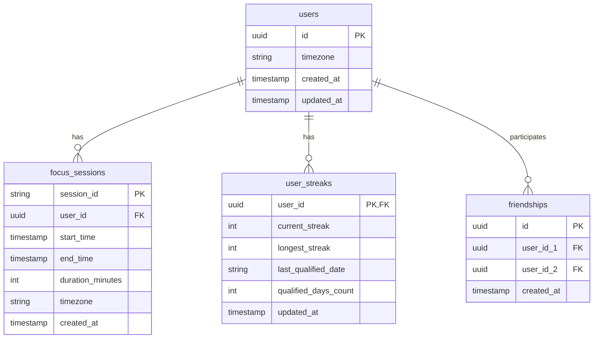

**Design Decisions**:

1. **`focus_sessions` as Event Log**
   - Immutable (insert-only)
   - `session_id` as PK for idempotency
   - Stores UTC timestamps + user's timezone

2. **`user_streaks` as Projection**
   - Denormalized for fast reads
   - Updated synchronously during session acceptance
   - Single source of truth: `focus_sessions`

3. **Indexes**:
   - `(user_id, start_time)` on `focus_sessions` for date range queries
   - `(user_id_1, user_id_2)` unique constraint on `friendships`

---

## Migration from Firebase to PostgreSQL

### Context: Opal's Current Architecture

This implementation is designed to migrate Opal's existing **Firebase Authentication + Firestore** stack to a hybrid architecture where PostgreSQL serves as the source of truth for relational data, while Firestore can optionally continue as a read projection for performance optimization.

**Current Opal Architecture** (assumed):

- **Firebase Authentication**: User authentication and identity management
- **Firestore**: Document-based storage for user data, sessions, and social graphs
- **Limitations**: Lack of ACID transactions, complex JOIN operations, and referential integrity for streaks and leaderboards

### Why PostgreSQL?

**Relational Consistency Requirements**:

1. **Streaks**: Requires consecutive day calculations with ACID guarantees
2. **Friendships**: Bidirectional relationships benefit from foreign key constraints
3. **Leaderboards**: Efficient JOINs across users, streaks, and friendships
4. **Data Integrity**: CASCADE deletes, unique constraints, and transactional updates

**Firestore as Projection** (Optional):

- Continue using Firestore as a read model for mobile clients
- PostgreSQL becomes the authoritative source
- Dual-write pattern during migration, eventual Firestore sync

---

### Migration Strategy

#### Phase 1: Dual Write (Transition Period)

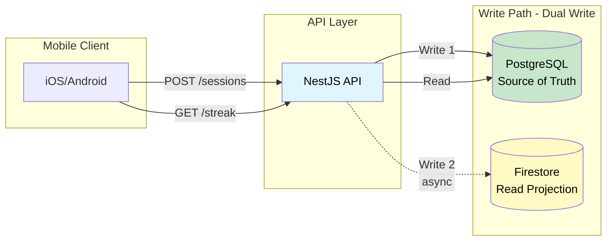

**Implementation**:

- All writes go to **PostgreSQL** (primary)
- Asynchronous writes to **Firestore** (secondary, best-effort)
- All reads from **PostgreSQL** (consistent data)
- Firestore write failures logged but don't block requests

**Benefits**:

- Zero downtime migration
- PostgreSQL becomes authoritative immediately
- Firestore continues serving legacy read paths (if needed)

---

#### Phase 2: Firestore as Projection (Future)

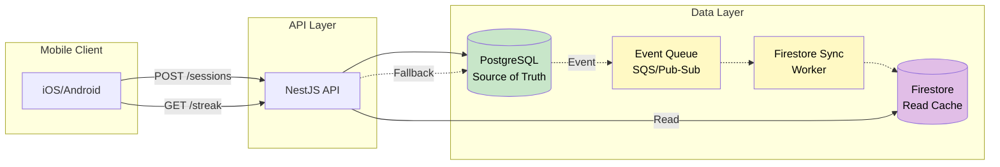

**Implementation**:

- PostgreSQL publishes change events (CDC or application-level)
- Event queue (AWS SQS / Google Pub/Sub) decouples write and sync
- Firestore sync worker updates Firestore asynchronously
- Read path: Firestore (fast) → PostgreSQL fallback (consistent)

**Benefits**:

- 5-10x faster reads (Firestore caching)
- PostgreSQL handles complex queries (leaderboards, JOINs)
- Eventually consistent reads acceptable for streaks (seconds lag)
- Horizontal scaling (workers can scale independently)

---

### Schema Mapping: Firestore → PostgreSQL

**Firestore Collections** (assumed):

```
/users/{userId}
  - timezone: string
  - createdAt: timestamp

/sessions/{sessionId}
  - userId: string
  - startTime: timestamp
  - endTime: timestamp
  - timezone: string

/streaks/{userId}
  - currentStreak: number
  - longestStreak: number
  - lastQualifiedDate: string
  - qualifiedDaysCount: number
```

**PostgreSQL Tables** (implemented):

```sql
users (id, timezone, created_at, updated_at)
focus_sessions (session_id PK, user_id FK, start_time, end_time, ...)
user_streaks (user_id PK FK, current_streak, longest_streak, ...)
friendships (id PK, user_id_1 FK, user_id_2 FK, ...)
```

**Key Differences**:

- **Referential Integrity**: Foreign keys enforce relationships (Firestore has no constraints)
- **Transactions**: ACID guarantees for streak calculations (Firestore has limited transactions)
- **Indexes**: Compound indexes on `(user_id, start_time)` for fast queries
- **Normalization**: Friendships use junction table (Firestore uses arrays or duplicates)

---

### Implementation Notes

**What's Included in This Submission**:

- ✅ PostgreSQL schema with foreign keys and indexes
- ✅ Repository pattern (easy to add Firestore dual-write adapter)
- ✅ CQRS pattern (separate read/write paths for future optimization)
- ✅ Domain-driven design (business logic isolated from infrastructure)

**What Would Be Added for Production**:

- Firestore repository implementation (dual-write adapter)
- Event publishing for async Firestore sync
- Monitoring for sync lag and write failures
- Rollback plan (Firestore → PostgreSQL data migration)

**Design Alignment with Requirements**:

> "Nice if Firestore becomes a projection, not the authority"

This architecture achieves exactly that:

- **PostgreSQL = Authority**: Source of truth for all streak, friendship, and leaderboard data
- **Firestore = Projection**: Optional read cache for performance optimization
- **Migration Path**: Dual Write → Event-Driven Sync → Firestore Deprecation (if desired)

---

## Data Flow - Session Acceptance

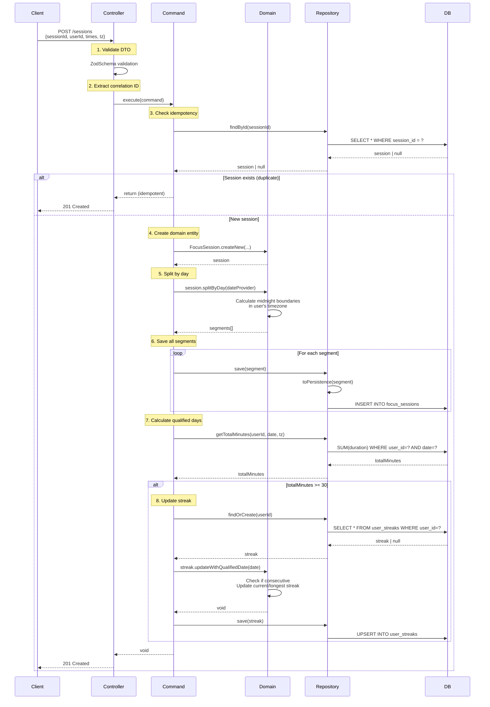

---

## Timezone Handling

Critical for correct streak calculation.

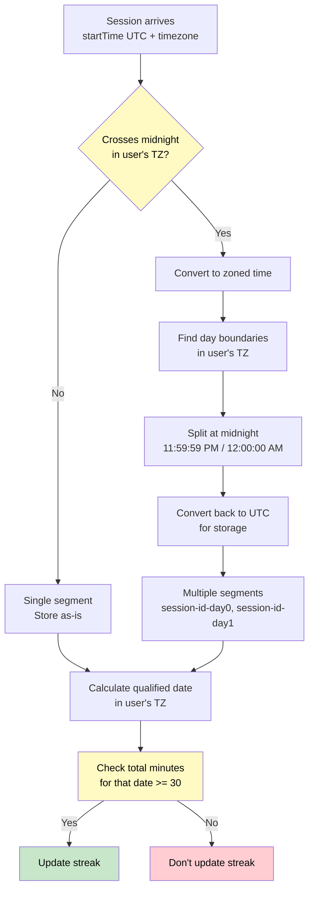

**Example**:

- Session: Jan 15 11:30 PM EST → Jan 16 12:30 AM EST (1 hour)
- In UTC: Jan 16 04:30 UTC → Jan 16 05:30 UTC
- **Problem**: Without timezone handling, appears as single day in UTC
- **Solution**: Split at EST midnight (Jan 16 05:00 UTC), creating 2 segments
- **Result**: Both Jan 15 and Jan 16 get qualified (30 min each)

---

## Streak Calculation Logic

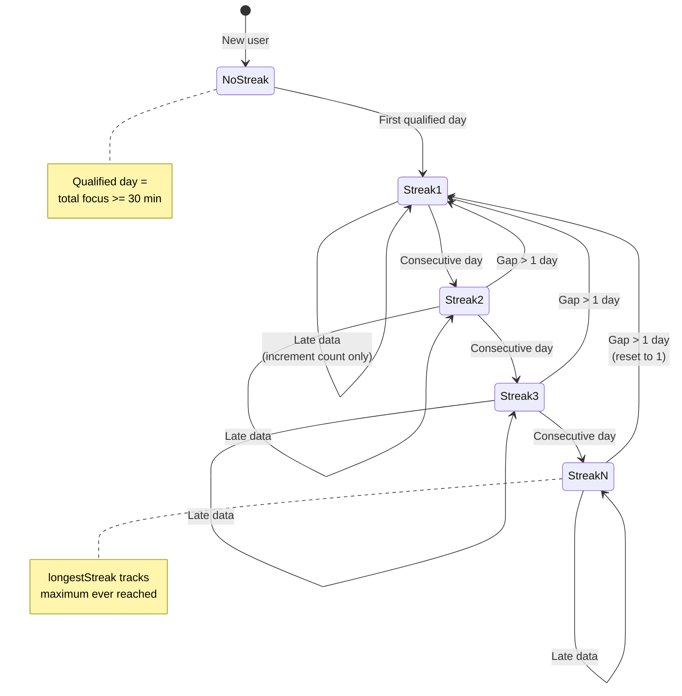

**Business Rules**:

1. **First Day**: streak = 1, longestStreak = 1
2. **Consecutive Day** (gap = 1): currentStreak++, update longestStreak if > previous
3. **Broken Streak** (gap > 1): currentStreak = 1, longestStreak preserved
4. **Same Day**: No change (idempotent)
5. **Late Data**: qualifiedDaysCount++, streak unchanged

---

## Testing Architecture

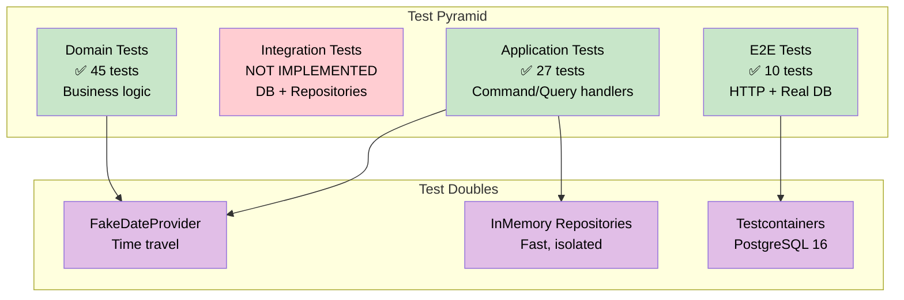

**Test Strategy**:

- **Domain Tests**: Pure business logic, no dependencies
- **Application Tests**: Uses InMemory repositories + FakeDateProvider
- **Integration Tests**: Not implemented (see [NOT_IMPLEMENTED.md](./NOT_IMPLEMENTED.md))
- **E2E Tests**: ✅ **Implemented** - 10 tests with Testcontainers (PostgreSQL 16)

**Why This Approach**:

- **Unit + Application**: Fast execution (< 500ms for 72 tests), no database dependency
- **E2E**: Real database validation with Testcontainers (PostgreSQL 16)
- **CI/CD friendly**: E2E tests work in any environment with Docker
- **Complete coverage**: Unit → Application → E2E across all layers

---

## Deployment Architecture

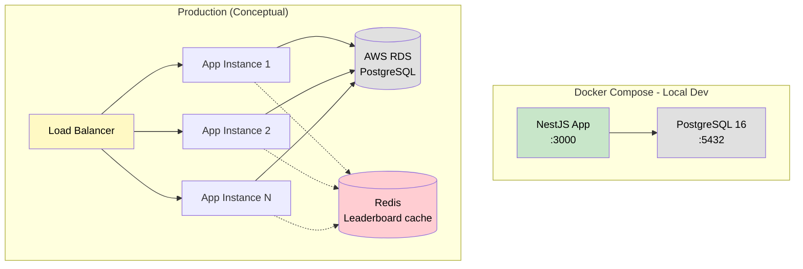

**Local Development**:

- Single app container + PostgreSQL
- Hot reload enabled
- Swagger docs at `/api/docs`

**Production (Future)**:

- Multiple app instances (horizontal scaling)
- Managed PostgreSQL (AWS RDS / Google Cloud SQL)
- Redis for leaderboard caching
- Load balancer for traffic distribution

---

## Key Architecture Decisions

### 1. **Hexagonal Architecture**

**Why**: Separates business logic from infrastructure concerns.
**Benefit**: Easy to test, swap implementations, maintain.

### 2. **CQRS Pattern**

**Why**: Different read/write optimization strategies.
**Benefit**: Fast reads (no aggregation), clear separation of concerns.

### 3. **Repository Pattern**

**Why**: Abstract database access behind interfaces.
**Benefit**: Testable with InMemory implementations, can swap databases.

### 4. **Date Provider Abstraction**

**Why**: Timezone operations are hard to test with real dates.
**Benefit**: `FakeDateProvider` allows time-travel in tests.

### 5. **Immutable Event Log**

**Why**: Sessions should never be deleted or modified.
**Benefit**: Complete audit trail, can replay events.

### 6. **Denormalized Streaks**

**Why**: Read performance (GET /users/:id/streak is simple SELECT).
**Trade-off**: Data duplication, but acceptable for this use case.

---

## Performance Characteristics

| Operation                       | Complexity | Notes                                   |
| ------------------------------- | ---------- | --------------------------------------- |
| **POST /sessions** (single day) | O(1)       | 2 DB writes (session + streak update)   |
| **POST /sessions** (multi-day)  | O(n)       | n = number of days spanned              |
| **GET /users/:id/streak**       | O(1)       | Single SELECT on user_streaks table     |
| **Qualified day check**         | O(1)       | SUM query with index on (user_id, date) |
| **Late data handling**          | O(1)       | Increment count only (no recalculation) |

**Database Indexes**:

- `(user_id, start_time)` on `focus_sessions` → Fast date range queries
- `user_id` PK on `user_streaks` → Fast streak lookups
- `(user_id_1, user_id_2)` unique on `friendships` → Prevent duplicates

---

## Scalability Considerations

### Current Limits

- **Writes**: ~1000 sessions/sec (single PostgreSQL instance)
- **Reads**: ~10,000 streaks/sec (denormalized table)

### Scaling Strategies

**Horizontal Scaling**:

- Multiple app instances behind load balancer
- Stateless application (no session data in memory)

**Database Scaling**:

- Read replicas for GET queries
- Connection pooling (Prisma built-in)
- Partitioning `focus_sessions` by date (for large datasets)

**Caching**:

- Redis for leaderboard results (5-min TTL)
- No caching for streak data (always up-to-date)

**Async Processing**:

- Queue session acceptance (SQS/RabbitMQ)
- Process streak updates asynchronously
- Eventual consistency acceptable for streaks

---

## Security Considerations

### Current Implementation

- ❌ No authentication (assumes trusted environment)
- ❌ No rate limiting
- ✅ Input validation (Zod schemas)
- ✅ SQL injection prevention (Prisma ORM)

### Production Requirements

- JWT authentication
- Per-user rate limiting (100 requests/min)
- API key for service-to-service calls
- HTTPS only
- CORS configuration
- Request logging with correlation IDs

---

## Monitoring & Observability

### Current Implementation

- ✅ Structured logging (Pino)
- ✅ Correlation ID tracking
- ✅ Health check endpoint

### Production Requirements

- **Metrics**: Request latency, error rates, throughput (Prometheus)
- **Tracing**: Distributed tracing (Jaeger/DataDog)
- **Logging**: Centralized logging (ELK stack / CloudWatch)
- **Alerting**: Critical error alerts (PagerDuty/Opsgenie)

**Key Metrics to Track**:

- Session acceptance rate
- Average streak length
- 95th percentile API latency
- Database query performance
- Failed streak calculations

---

## Further Reading

- **Domain Layer**: See individual entity files for business rule documentation
- **Testing Strategy**: See test files for edge case examples
- **Database Schema**: See `prisma/schema.prisma` for full schema
- **API Documentation**: See Swagger docs at `/api/docs` when running
