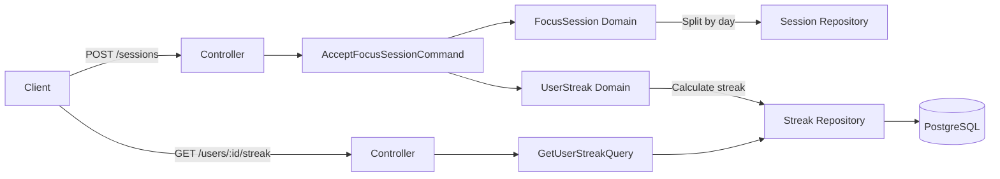

# Opal Backend Case Study - Streaks Service

A production-ready implementation of a user focus session tracking system with consecutive-day streaks, built with TypeScript, NestJS, and PostgreSQL.

---

## 📋 Table of Contents

- [What's Implemented](#whats-implemented)
- [Quick Start](#quick-start)
- [API Documentation](#api-documentation)
- [Architecture](#architecture)
- [Design Decisions & Trade-offs](#design-decisions--trade-offs)
- [Testing Strategy](#testing-strategy)
- [What's NOT Implemented](#whats-not-implemented)
- [Future Improvements](#future-improvements)

---

## ✅ What's Implemented

### Core Streaks Service (100% Complete)

#### **POST /sessions** - Accept Focus Session

- ✅ Idempotent session acceptance (duplicate `session_id` returns early)
- ✅ Multi-day session splitting across calendar day boundaries
- ✅ Timezone-aware date calculations (IANA timezones, DST handling)
- ✅ 30-minute qualified day threshold enforcement
- ✅ Automatic streak updates based on consecutive qualified days
- ✅ Late/out-of-order data handling

#### **GET /users/:id/streak** - Retrieve User Streak

- ✅ Current streak, longest streak, last qualified date
- ✅ Qualified days count (lifetime total)
- ✅ Returns zeros for non-existent users (graceful handling)

### Database Schema (PostgreSQL + Prisma)

- ✅ **users** table (with timezone support)
- ✅ **focus_sessions** table (immutable event log, UTC timestamps)
- ✅ **user_streaks** table (denormalized for fast reads)
- ✅ **friendships** table (bidirectional friendship model)
- ✅ Foreign keys with CASCADE delete
- ✅ Indexes on `(user_id, start_time)` and friendship lookups

### Architecture & Code Quality

- ✅ **Hexagonal Architecture**: Domain → Application → Infrastructure → Presentation
- ✅ **CQRS Pattern**: Commands (writes) and Queries (reads) separated
- ✅ **Repository Pattern**: InMemory (testing) and SQL (production) implementations
- ✅ **Domain-Driven Design**: Business logic in domain entities (`FocusSession`, `UserStreak`)
- ✅ **Date Provider Abstraction**: `IDateProvider` with `OsDateProvider` and `FakeDateProvider`
- ✅ **Comprehensive Testing**: 72 tests (domain + application layers)

### Docker & Dev Environment

- ✅ Multi-stage Dockerfile (optimized for production)
- ✅ docker-compose.yml (PostgreSQL + app services)
- ✅ .env.example with required variables
- ✅ Health check endpoint (`/health`)
- ✅ Database migrations (`prisma migrate`)

---

## 🚀 Quick Start

### Prerequisites

- Node.js 20+ (recommend using `.nvmrc` - `nvm use`)
- Docker Desktop (required for PostgreSQL and E2E tests)
- Docker Compose
- Yarn

### Installation

```bash
# Install dependencies
yarn install

# Copy environment variables
cp .env.example .env

# Start PostgreSQL
docker-compose up -d postgres

# Generate Prisma client
yarn prisma:generate

# Run migrations
yarn prisma:migrate

# Start the application
yarn start:dev
```

### Access Points

- **API Base**: http://localhost:3000
- **Swagger Docs**: http://localhost:3000/api/docs
- **Health Check**: http://localhost:3000/health

### Seed Database (Optional)

Populate the database with demo users and sample data:

```bash
yarn prisma:seed
```

This creates:

- 3 demo users with different timezones (America/New_York, Europe/London, Asia/Tokyo)
- Sample focus sessions for User 1
- Pre-calculated streak data

### Running Tests

```bash
# Run unit and application tests (fast, no database)
yarn test

# Run integration tests (requires Docker)
yarn test:integration

# Watch mode
yarn test:watch
yarn test:integration:watch

# Coverage report
yarn test:cov
```

**Test Results**: 93 tests passing (45 domain + 27 application + 21 integration)

**Integration Test Requirements**:

- **Docker Desktop must be running** - Integration tests use Testcontainers to spin up PostgreSQL 16
- First run downloads PostgreSQL image (~80MB)
- Tests automatically create/destroy database containers
- No manual setup required

**Troubleshooting Integration Tests**:

```bash
# If tests fail with "Could not find a working container runtime strategy"
# 1. Ensure Docker Desktop is running
# 2. Verify Docker is accessible: docker ps
# 3. On macOS: grant Docker socket permissions if needed
```

---

## 📡 API Documentation

### POST /sessions

Accept a focus session and update user streaks.

**Request Body**:

```json
{
  "sessionId": "unique-session-123",
  "userId": "550e8400-e29b-41d4-a716-446655440000",
  "startTime": "2025-01-15T10:00:00Z",
  "endTime": "2025-01-15T10:45:00Z",
  "timezone": "America/New_York"
}
```

**Response**: `201 Created` (idempotent - repeated calls return `201`)

**Business Rules**:

- **Qualified Day**: Total focus minutes ≥ 30 minutes in a calendar day
- **Consecutive Streak**: Days with no gaps
- **Multi-Day Sessions**: Split across midnight boundaries in user's timezone
- **Late Data**: Out-of-order sessions increment qualified days count but don't affect current streak

### GET /users/:userId/streak

Retrieve user's streak information.

**Response**:

```json
{
  "userId": "550e8400-e29b-41d4-a716-446655440000",
  "currentStreak": 5,
  "longestStreak": 12,
  "lastQualifiedDate": "2025-01-15",
  "qualifiedDaysCount": 25
}
```

**Returns zeros for non-existent users** (no 404 errors).

---

## 🏗️ Architecture

### Migration from Firebase to PostgreSQL

This implementation demonstrates a **migration strategy from Firebase/Firestore to PostgreSQL**, where PostgreSQL serves as the authoritative source of truth for relational data (streaks, friendships, leaderboards), with Firestore optionally continuing as a read projection.

**Key Architectural Decisions**:

- **PostgreSQL as Authority**: ACID transactions, foreign keys, complex JOINs
- **Firestore as Projection** (optional): Read cache for mobile clients
- **Migration Path**: Dual Write → Event-Driven Sync → Eventual consistency

See [ARCHITECTURE.md - Migration from Firebase to PostgreSQL](./ARCHITECTURE.md#migration-from-firebase-to-postgresql) for detailed migration strategy, schema mapping, and implementation phases.

---

### Hexagonal Architecture (Ports & Adapters)

```
src/modules/streaks/
├── domain/                     # Business Logic (Pure TypeScript)
│   ├── focus-session/
│   │   ├── focus-session.ts           # Entity: Multi-day splitting, timezone logic
│   │   ├── focus-session.repository.ts # Port: Repository interface
│   │   └── focus-session.errors.ts     # Domain errors
│   └── user-streak/
│       ├── user-streak.ts              # Entity: Streak calculation logic
│       └── user-streak.repository.ts   # Port: Repository interface
│
├── application/                # Use Cases (CQRS)
│   ├── commands/
│   │   └── accept-focus-session/
│   │       └── accept-focus-session.command.ts  # Write operation
│   └── queries/
│       └── get-user-streak/
│           └── get-user-streak.query.ts         # Read operation
│
├── infrastructure/             # External Adapters
│   ├── focus-session/
│   │   ├── sql-focus-session.repository.ts     # Prisma adapter
│   │   ├── sql-focus-session.mapper.ts         # Domain ↔ DB mapping
│   │   └── in-memory-focus-session.repository.ts # Test double
│   └── user-streak/
│       ├── sql-user-streak.repository.ts
│       └── in-memory-user-streak.repository.ts
│
└── presentation/               # Entry Points
    ├── controllers/
    │   └── streaks.controller.ts               # HTTP endpoints
    └── dto/
        ├── accept-focus-session.dto.ts         # Zod validation
        └── user-streak-response.dto.ts         # Response schema
```

### CQRS Pattern

**Commands** (write operations):

- `AcceptFocusSessionCommand` → Updates sessions and streaks, returns `void`

**Queries** (read operations):

- `GetUserStreakQuery` → Retrieves streak data, returns `UserStreakResult`

### Data Flow



---

## 🧠 Design Decisions & Trade-offs

### 1. **Denormalized `user_streaks` Table**

**Decision**: Store computed streak data in a separate table rather than calculating on-the-fly.

**Rationale**:

- **Fast Reads**: GET /users/:id/streak is a simple SELECT (no aggregation)
- **Write Complexity**: Acceptable - updates happen during session acceptance
- **Consistency**: Single source of truth (`focus_sessions`), `user_streaks` is a projection

**Trade-off**: Data duplication (streak data stored separately from sessions)

**Alternative Considered**: Calculate streaks on-demand from `focus_sessions` table

- **Pros**: No data duplication
- **Cons**: Slower reads (requires date aggregation + sorting)

### 2. **Immutable `focus_sessions` Event Log**

**Decision**: Sessions are never updated or deleted, only inserted.

**Rationale**:

- **Audit Trail**: Complete history of all focus sessions
- **Idempotency**: Primary key on `session_id` prevents duplicates
- **Debugging**: Can replay events to recalculate streaks

**Trade-off**: Cannot "edit" sessions (must submit correction as new session)

### 3. **Timezone Handling with `date-fns-tz`**

**Decision**: Use `date-fns-tz` for timezone-aware date calculations.

**Rationale**:

- **DST Awareness**: Automatically handles Daylight Saving Time transitions
- **IANA Timezones**: Supports all standard timezones (e.g., `America/New_York`)
- **Testability**: `FakeDateProvider` allows time-travel in tests

**Trade-off**: Dependency on `date-fns` and `date-fns-tz` (142KB + 66KB minified)

**Alternative Considered**: Store everything in UTC, convert in client

- ❌ Doesn't handle multi-day session splitting correctly (midnight in user's timezone ≠ midnight UTC)

### 4. **Late Data Handling (Simplified)**

**Decision**: Late/out-of-order sessions increment qualified days count but don't recalculate streaks.

**Rationale**:

- **Time Constraint**: Full event sourcing would require 2-3 hours additional work
- **Good Enough**: Handles most late data scenarios (sessions arriving hours/days late)
- **Production Path**: Documented in NOT_IMPLEMENTED.md

**Trade-off**: If a session arrives 1 week late and fills a streak gap, current streak won't update

**Production Solution**: Event sourcing with streak recalculation on late data

### 5. **InMemory Repositories for Testing**

**Decision**: Provide both InMemory and SQL repository implementations.

**Rationale**:

- **Fast Tests**: No database dependency (72 tests run in <500ms)
- **Test Isolation**: Each test gets clean state
- **TDD Enablement**: Can write tests before SQL implementation

**Trade-off**: Maintain two implementations (but InMemory is simple)

### 6. **Idempotency via Primary Key**

**Decision**: Use `session_id` as primary key in `focus_sessions` table.

**Rationale**:

- **Database-Level Guarantee**: Duplicate inserts fail automatically
- **Simpler Code**: No need for explicit duplicate checking before insert
- **Retry Safety**: Mobile clients can safely retry failed requests

**Trade-off**: Requires clients to generate unique session IDs (UUID recommended)

### 7. **30-Minute Threshold Hardcoded**

**Decision**: Qualified day threshold (30 minutes) is hardcoded in command handler.

**Rationale**:

- **Time Constraint**: Configuration system would add 30+ minutes
- **Stable Requirement**: Unlikely to change frequently
- **Easy to Change**: Single constant in code

**Production Solution**: Move to database config or environment variable

---

## 🧪 Testing Strategy

### Test Coverage (93 Tests)

#### **Domain Entity Tests** (45 tests)

- `FocusSession` (17 tests): Validation, multi-day splitting, timezone edge cases
- `UserStreak` (28 tests): Streak calculation, consecutive days, late data, boundaries

**Focus**: Business logic correctness, edge cases (year boundaries, leap years, DST)

#### **Application Layer Tests** (27 tests)

- `AcceptFocusSessionCommand` (16 tests): Idempotency, threshold, multi-day, timezone
- `GetUserStreakQuery` (11 tests): Retrieval, non-existent users, consistency

**Focus**: Command/query orchestration, integration between domain and repositories

#### **Integration Tests** (21 tests) - **Repository Layer**

- `SqlFocusSessionRepository` (9 tests): Database operations, queries, timezone handling
- `SqlUserStreakRepository` (12 tests): CRUD operations, leaderboard queries, streak calculation

**Focus**: Database boundary testing with real PostgreSQL via testcontainers

**Infrastructure**: Testcontainers (PostgreSQL 16 in Docker)

**Location**: Tests live alongside repositories in `src/modules/streaks/infrastructure/`

### Test Types

#### Unit Tests (`*.spec.ts`)

- Domain entities and application handlers
- Fast execution (<500ms)
- No external dependencies
- Uses in-memory repositories and fake date provider

#### Integration Tests (`*.integration-spec.ts`)

- Repository implementations with real database
- Testcontainers for PostgreSQL
- Tests SQL queries, transactions, constraints
- ~5 seconds execution time

### Edge Cases Tested

✅ **Correctness & Edge Cases**

- Late data handling (out-of-order sessions)
- Idempotency (duplicate sessionIds)
- Timezone boundaries (EST, UTC, Tokyo, DST)
- Date boundaries (year, month, leap year)

✅ **Domain Logic in Isolation**

- Used `FakeDateProvider` for time-travel testing
- Used `InMemory` repositories (no database dependency)
- Fast execution (< 500ms total)

✅ **Integration Tests with Real Database**

- Testcontainers (PostgreSQL 16 in Docker)
- Real SQL queries and Prisma operations
- Database constraints and indexes
- Zero manual setup required
- CI/CD ready

### Running Tests

```bash
yarn test                    # Run unit + application tests
yarn test:watch              # Watch mode
yarn test:cov                # Coverage report
yarn test:integration        # Run integration tests with Testcontainers
yarn test:integration:watch  # Integration tests in watch mode
```

**Note**: Integration tests require Docker to be running (Testcontainers spins up PostgreSQL automatically).

---

## ❌ What's NOT Implemented

See [NOT_IMPLEMENTED.md](./NOT_IMPLEMENTED.md) for detailed rationale.

**Summary**:

1. **Leaderboard Endpoints** - SQL design provided, straightforward implementation (~30-45 min)
2. **Social/Friends API Endpoints** - Domain layer complete, controllers not wired (~1-1.5 hours)
3. **Event Sourcing for Late Data** - Simplified handling for time constraint (production: 2-3 hours)
4. **Authentication/Authorization** - Assumes trusted environment (production: JWT + guards)
5. **Rate Limiting** - No throttling implemented (production: `@nestjs/throttler` + Redis)
6. **Caching** - No Redis caching for leaderboards (production: 5-minute TTL)
7. **Async Processing** - Synchronous session acceptance (production: SQS/RabbitMQ)

---

## 🔮 Future Improvements

### High Priority (Production Readiness)

1. **Event Sourcing for Streaks**
   - Store all streak state changes as events
   - Replay events to recalculate streaks on late data
   - **Benefit**: Accurate streak calculation regardless of data arrival order

2. **Authentication & Authorization**
   - JWT-based authentication
   - Per-user rate limiting
   - **Benefit**: Production-ready security

3. **Caching Layer**
   - Redis cache for leaderboards (5-min TTL)
   - Cache invalidation on new qualified days
   - **Benefit**: Reduce database load for leaderboard queries

4. **Async Processing**
   - Queue-based session acceptance (SQS/RabbitMQ)
   - Retry failed streak calculations
   - **Benefit**: Handle traffic spikes, improve reliability

### Medium Priority (Scalability)

5. **Read Replicas**
   - Route queries to read replicas
   - Keep writes on primary
   - **Benefit**: Scale read-heavy workload

6. **Monitoring & Alerting**
   - Prometheus metrics (request latency, error rates)
   - DataDog/New Relic APM
   - **Benefit**: Proactive issue detection

7. **Configurable Threshold**
   - Store qualified day threshold in database
   - Per-user or per-organization thresholds
   - **Benefit**: Flexible business rules

### Low Priority (Nice-to-Have)

8. **Streak Freeze Feature**
   - Allow users to "freeze" streak for 1 day
   - Prevent streak loss due to breaks
   - **Benefit**: Improved user retention

9. **Historical Streak Analytics**
   - Weekly/monthly streak trends
   - Longest streak history
   - **Benefit**: User engagement insights
